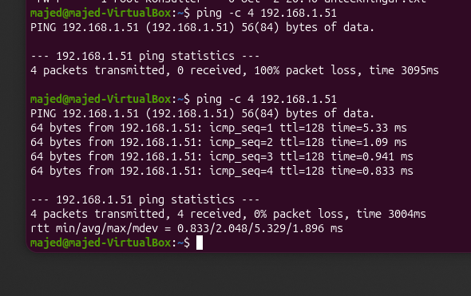
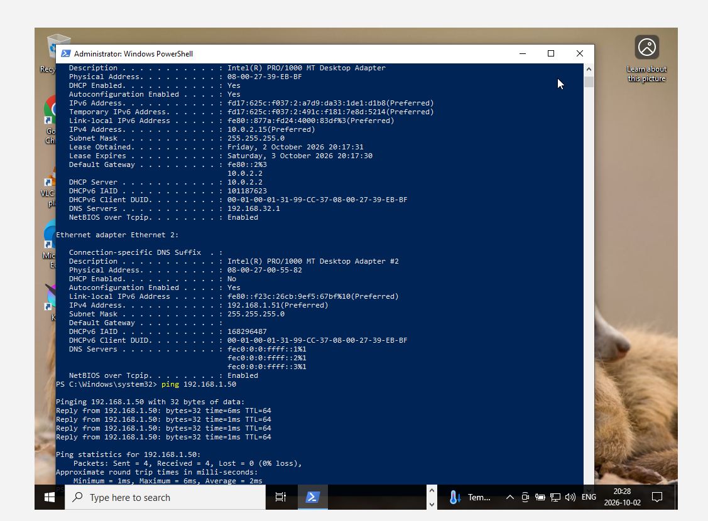
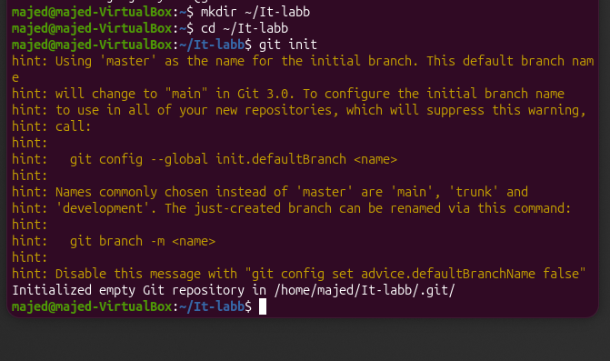
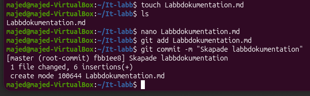
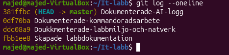

# Labbdokumentation

Namn: Majed Jindi  
Datum: 2026-10-02  
Kurs: Introduktion till yrkesrollen och grunderna i IT-infrastruktur

## Introduktion

I denna labb har jag skapat en virtuell labbmiljö med Ubuntu och Windows 10 i VirtualBox. Jag har testat nätverk, behörigheter, kommandorad, Git och felsökning.

## Labbmiljö och nätverk

Jag skapade två virtuella datorer i VirtualBox, en Ubuntu och en Windows 10. Båda datorerna ligger på samma interna nätverk så att de kan kommunicera med varandra.

| Hostname | Operativsystem | IP-adress | Subnätmask | Standard Gateway |
|---|---|---|---|---|
| majed-VirtualBox | Ubuntu | 192.168.1.50 | 255.255.255.0 | Ingen, internt nätverk |
| LAPTOP-P55MHJUE | Windows 10 | 192.168.1.51 | 255.255.255.0 | Ingen, internt nätverk |

I Ubuntu kontrollerade jag nätverkskortet med:

```bash
ip -4 addr show enp0s8
```

Ubuntu hade IP-adressen 192.168.1.50/24.

Jag testade sedan anslutningen från Ubuntu till Windows med:

```bash
ping -c 4 192.168.1.51
```

Första gången fungerade det inte och jag fick 100% packet loss. Problemet var Windows brandvägg. Efter att jag ändrade brandväggsinställningen testade jag igen och då fick jag 0% packet loss.



I Windows kontrollerade jag nätverket med `ipconfig /all` och testade sedan ping till Ubuntu.

```powershell
ipconfig /all
ping 192.168.1.50
```

Ping fungerade och visade 0% loss.



## Linux och behörigheter

I Ubuntu skapade jag mappen `/var/systementor/konsultdata`, filen `anteckningar.txt` och gruppen `konsulter`.

Jag använde dessa kommandon:

```bash
sudo mkdir -p /var/systementor/konsultdata
sudo touch /var/systementor/konsultdata/anteckningar.txt
sudo groupadd konsulter
sudo chown root:konsulter /var/systementor/konsultdata
sudo chmod 750 /var/systementor/konsultdata
sudo chown root:konsulter /var/systementor/konsultdata/anteckningar.txt
sudo chmod 640 /var/systementor/konsultdata/anteckningar.txt
sudo usermod -aG konsulter majed
```

Jag kontrollerade sedan gruppen och behörigheterna med:

```bash
groups
ls -la /var/systementor/konsultdata
```

Mappen fick behörigheten 750 och filen fick 640.

750 betyder att ägaren har full behörighet. Gruppen kan läsa och öppna mappen och andra användare har ingen behörighet.

640 betyder att ägaren kan läsa och skriva filen. Gruppen kan läsa filen och andra användare har ingen behörighet.

Detta följer principen om Least Privilege eftersom användarna bara får de behörigheter som de behöver.


## Windows

I Windows använde jag PowerShell.

Jag skapade mappen:

```powershell
mkdir C:\Systementor\KonsultData
```

Jag kontrollerade sedan ACL och behörigheterna med:

```powershell
Get-Acl C:\Systementor\KonsultData
```

Resultatet visade bland annat att Administrators hade FullControl.


Jag använde också dessa kommandon för att kontrollera nätverket:

```powershell
ipconfig /all
ping 192.168.1.50
```

Det visade Windows IP-adress 192.168.1.51 och ping till Ubuntu fungerade.


## Git och versionshantering

Jag skapade en mapp för labben och initierade ett Git repository med kommandoraden.

```bash
mkdir ~/IT-labb
cd ~/IT-labb
git init
```



Jag skapade sedan dokumentationsfilen och började spara mina ändringar med Git.

Jag använde bland annat:

```bash
git add Labbdokumentation.md
git commit -m "Skapade labbdokumentation"
git status
git push
```

Jag gjorde flera olika commits under arbetets gång så att det går att se hur projektet har utvecklats.

Exempel på en av mina första commits:



Jag kontrollerade commit-historiken med:

```bash
git log --oneline
```



Mitt GitHub repository:

https://github.com/majdjendy1233-web/IT-labb

## AI-logg och utvärdering

Jag använde ChatGPT som stöd under labben. Jag använde AI för att förstå vissa Linux och Git kommandon och för felsökning när ping mellan Ubuntu och Windows inte fungerade.

### Prompt

(Jag har Ubuntu och Windows 10 i VirtualBox. Ubuntu har IP-adressen 192.168.1.50 och Windows har 192.168.1.51. Ping från Ubuntu till Windows fungerar inte. Vad kan problemet vara och hur kan jag lösa det?)
### AI-svar

AI förklarade att en möjlig orsak till att ping inte fungerade var Windows brandvägg. Windows kan blockera ICMP som används av ping.

AI föreslog att jag först skulle kontrollera att båda virtuella datorerna hade IP-adresser i samma nätverk och sedan kontrollera brandväggsinställningen i Windows.

Jag ändrade inställningen i Windows och testade sedan ping igen från Ubuntu.

Efter ändringen fungerade ping och resultatet visade 0% packet loss.

### Kritisk utvärdering

I detta fall var AI-svaret korrekt eftersom problemet faktiskt var Windows brandvägg.

Jag verifierade svaret genom att testa kommandot själv före och efter ändringen. Först fick jag 100% packet loss och efter ändringen fick jag 0% packet loss.

Jag hittade inga tydliga hallucinationer eller föråldrade kommandon i detta svar.

En möjlig säkerhetsrisk är att öppna brandväggsregler för mycket. Därför använde jag ändringen bara i min isolerade virtuella labbmiljö.

Jag tycker att AI var bra som stöd för felsökning och förklaringar. Men man måste fortfarande kontrollera kommandona själv och förstå vad de gör innan man använder dem.

Jag gjorde kommandona och testerna själv i mina virtuella maskiner och kontrollerade resultatet.
